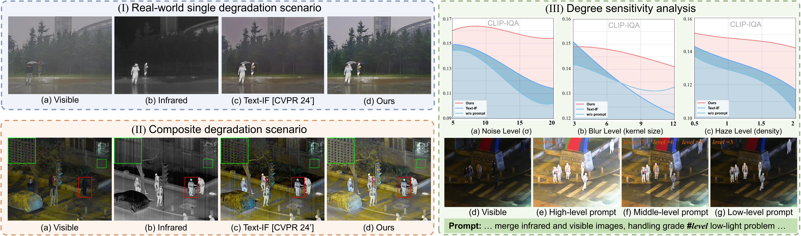
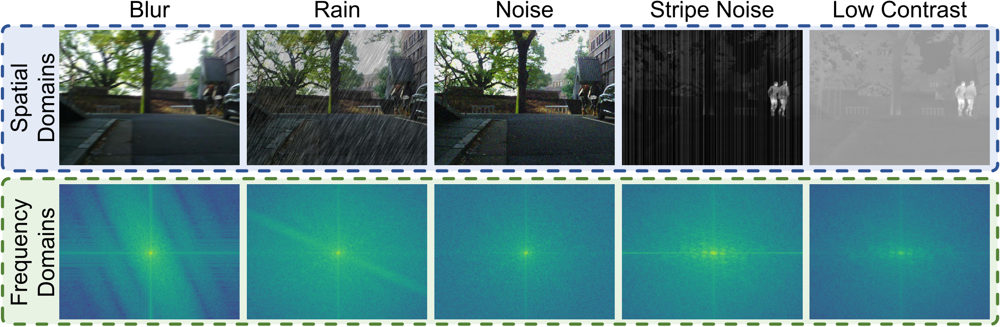
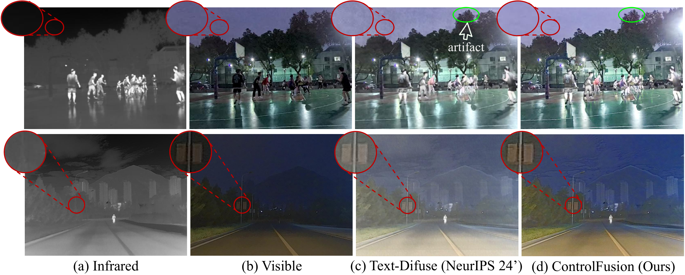

<div align="center" style="text-decoration: none !important;">
    <h1>
      <a href="https://arxiv.org/pdf/2503.23356?" target="_blank" style="text-decoration: none !important;">ControlFusion: A Controllable Image Fusion Framework with Language-Vision Degradation Prompts [NeurIPS 2025]</a> 
    </h1>
    <div>
        <a href='https://github.com/Linfeng-Tang' target='_blank' style="text-decoration: none !important;">Linfeng Tang<sup>1*</sup></a>,&emsp;
        <a href='https://github.com/LfWhat' target='_blank' style="text-decoration: none !important;">Yeda Wang<sup>1*</sup></a>,&emsp;
        <a href='#' target='_blank' style="text-decoration: none !important;">Zhanchuan Cai<sup>2</sup></a>,&emsp;
        <a href='#' target='_blank' style="text-decoration: none !important;">Junjun Jiang<sup>3</sup></a>,&emsp;
        <a href='https://sites.google.com/site/jiayima2013' target='_blank' style="text-decoration: none !important;">Jiayi Ma<sup>1&#8224;</sup></a>
    </div>
    <div>
        <sup>1</sup>Wuhan University &emsp;
        <sup>2</sup>Macau University of Science and Technology &emsp;
        <sup>3</sup>Harbin Institute of Technology <br>
        <sup>*</sup>Equal Contribution &emsp; <sup>&#8224;</sup>Corresponding Author
    </div>
    <br>
    <div style="text-decoration: none !important;">
        <a href="https://github.com/Linfeng-Tang/ControlFusion" target='_blank' style="text-decoration: none !important; border: none !important;">
            
        </a>
        <a href="https://arxiv.org/pdf/2503.23356?" target='_blank' style="text-decoration: none !important; border: none !important;">
            
        </a>
    </div>
</div>


## 🔎 Method Overview
###  Motivation


###  Framework


###  Frequency Domain Comparison


## 🔧 Environment Setup
1.  **Clone this repository:**
    ```bash
    git clone https://github.com/Linfeng-Tang/ControlFusion.git
    cd ControlFusion
    ```

2.  **Create a Conda environment (recommended):**
    ```bash
    conda create -n controlfusion python=3.8 -y
    conda activate controlfusion
    ```

3.  **Install dependency packages:**
    ```bash
    pip install -r requirements.txt
    ```
## 📂 Dataset Construction
    please refer to genDateset
## 📂 Dataset Download
[Google Drive](https://drive.google.com/file/d/1SLfMDtWXpkngEi5eIAYuxEg6Y2UF6HBL/view?usp=drive_link)
## 📥 Pre-trained Weights
#### Download the pretrained model Mask-DiFuser from [Baidu Drive](https://pan.baidu.com/s/1zIvBFFxLxtID732uU_xPyw?pwd=j9h7), and put the weight into `pretrained_weights/`.

## 🧪 Inference

You can use the `test.py` script we provide to fuse pairs of images. Please make sure you have downloaded the pre-trained weights.
You can modify ControlFusion.py to select text/auto control by:
```bash
text_features = self.get_text_feature(text.expand(b, -1)).to(inp_img_A.dtype)
text_features = imgfeature
```

## 🚂 Train

You can use the `train.py` script we provide to train. Make sure you have organized your train dataset correctly.

## 📷 Results
### Visualization of fusion results in different degraded scenarios


### Generalization results in the real world



## 🕵️‍♂️ Detection


## 🎓 Citations
If our work is useful for your research, please consider citing and give us a star ⭐:
```
@inproceedings{Tang2024Mask-DiFuser,
  author={Linfeng Tang, Yeda Wang, Zhanchuan Cai, Junjun Jiang, and Jiayi Ma},
  title={ControlFusion: A Controllable Image Fusion Network with Language-Vision Degradation Prompts}, 
  booktitle={Advances in Neural Information Processing Systems},
  year={2025},
 }
```


## 🤝 Contact
Please feel free to contact: `linfeng0419@gmail.com, wangyeda@whu.edu.cn`. 
We are very pleased to communicate with you and will maintain this repository during our free time.

