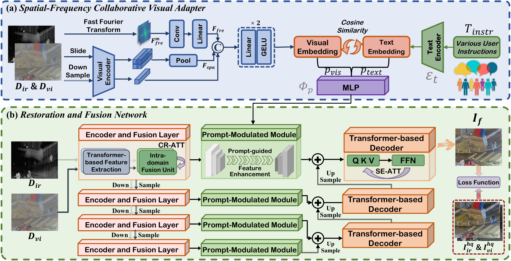

<div align="center">
    <h1>
      <a href="https://arxiv.org/pdf/2503.23356?" target="_blank">ControlFusion: A Controllable Image Fusion Framework with Language-Vision Degradation Prompts</a>
    </h1>
    <div>
        <a href='https://github.com/Linfeng-Tang' target='_blank'>Linfeng Tang<sup>1*</sup></a>,&emsp;
        <a href='https://github.com/LfWhat' target='_blank'>Yeda Wang<sup>1*</sup></a>,&emsp;
        <a href='#' target='_blank'>Zhanchuan Cai<sup>2</sup></a>,&emsp;
        <a href='#' target='_blank'>Junjun Jiang<sup>3</sup></a>,&emsp;
        <a href='https://sites.google.com/site/jiayima2013' target='_blank'>Jiayi Ma<sup>1&#8224;</sup></a>
    </div>
    <div>
        <sup>1</sup>Wuhan University &emsp;
        <sup>2</sup>Macau University of Science and Technology &emsp;
        <sup>3</sup>Harbin Institute of Technology <br>
        <sup>*</sup>Equal Contribution &emsp; <sup>&#8224;</sup>Corresponding Author
    </div>
    <br>
    <div>
        <a href="https://github.com/Linfeng-Tang/ControlFusion" target='_blank'>
            
        </a>
        <a href="https://arxiv.org/pdf/2503.23356?" target='_blank'>
            
        </a>
    </div>
</div>

## 🔎 Method Overview




## 🔧 Environment Setup
1.  **Clone this repository:**
    ```bash
    git clone https://github.com/Linfeng-Tang/ControlFusion.git
    cd ControlFusion
    ```

2.  **Create a Conda environment (recommended):**
    ```bash
    conda create -n controlfusion python=3.8 -y
    conda activate controlfusion
    ```

3.  **Install dependency packages:**
    ```bash
    pip install -r requirements.txt
    ```
## 📂 Dataset Construction
    please refer to genDateset,To simulate light degradation, use Lightroom Classic
    Our dataset will be open sourced soon.
## 📥 Pre-trained Weights
#### Download the pretrained model Mask-DiFuser from [Baidu Drive](https://pan.baidu.com/s/1zIvBFFxLxtID732uU_xPyw?pwd=j9h7), and put the weight into `pretrained_weights/`.

## 🧪 Inference

You can use the `test.py` script we provide to fuse pairs of images. Please make sure you have downloaded the pre-trained weights

## 🚂 Train

You can use the `train.py` script we provide to train. Make sure you have organized your train dataset correctly.

## 📷 Results


## 🕵️‍♂️ Detection


## 🎓 Citations
If our work is useful for your research, please consider citing and give us a star ⭐:
```
@inproceedings{Tang2024Mask-DiFuser,
  author={Linfeng Tang, Yeda Wang, Zhanchuan Cai, Junjun Jiang, and Jiayi Ma},
  title={ControlFusion: A Controllable Image Fusion Network with Language-Vision Degradation Prompts}, 
  booktitle={Advances in Neural Information Processing Systems},
  year={2025},
 }
```


## 🤝 Contact
Please feel free to contact: `linfeng0419@gmail.com, licy0089@gmail.com`. 
We are very pleased to communicate with you and will maintain this repository during our free time.

